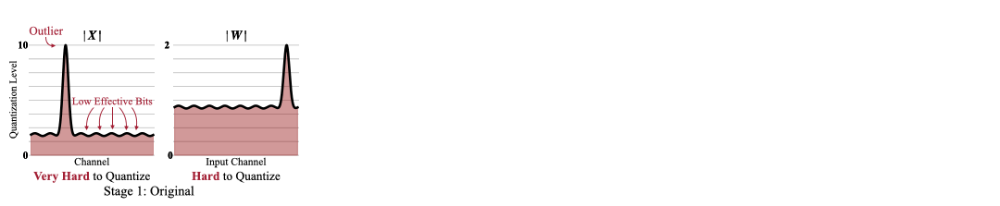

# SVDQuant 扩散模型量化实验

本目录包含 SVDQuant 算法在扩散模型上的复现实验，主要针对 FLUX.1-schnell 和 PixArt-Sigma 模型进行 4 位量化。

## 算法简介

SVDQuant 是一种针对扩散模型的 4 位量化方法：

- **核心思想**：通过低秩分支吸收异常值，而非传统的平滑量化方法
- **量化精度**：支持 INT4 (W4A4) 和 NVFP4 (FP4 E2M1) 格式
- **推理加速**：配合 Nunchaku 推理引擎可实现 3.0× 加速



## 实验配置

### 硬件环境

| 配置项 | 规格 |
|--------|------|
| GPU | NVIDIA A100 (80GB) × 1 |
| CPU | 8核 |
| 内存 | 250GB |

### 测试模型

| 模型 | 参数量 | 原始精度 | 推理步数 | Guidance Scale |
|------|--------|----------|----------|----------------|
| FLUX.1-schnell | 12B | BFloat16 | 4 | 0 |
| PixArt-Sigma | 0.6B | Float16 | 20 | 4.5 |

### 评估数据集

| 数据集 | 描述 | 样本数 |
|--------|------|--------|
| MJHQ-30K | 高质量美学图像数据集 | 1024/5000 |
| sDCI | 密集描述图像数据集 | 1024/5000 |

## 实验步骤

### Step 1: 生成 Baseline 参考图像

```bash
# FLUX.1-schnell BF16 baseline
python -m deepcompressor.app.diffusion.ptq \
    configs/model/flux.1-schnell.yaml \
    --output-dirname reference \
    --eval-num-samples 5000

# PixArt-Sigma FP16 baseline
python -m deepcompressor.app.diffusion.ptq \
    configs/model/pixart-sigma.yaml \
    --output-dirname reference \
    --eval-num-samples 1024
```

### Step 2: 准备校准数据集

```bash
python -m deepcompressor.app.diffusion.dataset.collect.calib \
    configs/model/flux.1-schnell.yaml configs/collect/qdiff.yaml
```

### Step 3: 运行 SVDQuant 量化

#### FLUX.1-schnell INT4 量化

```bash
python -m deepcompressor.app.diffusion.ptq \
    configs/model/flux.1-schnell.yaml configs/svdquant/int4.yaml \
    --eval-benchmarks MJHQ --eval-num-samples 1024
```

#### FLUX.1-schnell NVFP4 量化

```bash
python -m deepcompressor.app.diffusion.ptq \
    configs/model/flux.1-schnell.yaml configs/svdquant/nvfp4.yaml \
    --eval-benchmarks MJHQ --eval-num-samples 1024
```

#### PixArt-Sigma INT4 量化

```bash
python -m deepcompressor.app.diffusion.ptq \
    configs/model/pixart-sigma.yaml configs/svdquant/int4.yaml \
    --eval-benchmarks MJHQ --eval-num-samples 1024
```

## 实验结果

### 评估指标说明

| 指标 | 描述 | 方向 |
|------|------|------|
| FID | 生成图像与真实图像分布距离 | ↓ 越低越好 |
| CLIP-IQA | 基于CLIP的图像质量评估 | ↑ 越高越好 |
| CLIP Score | 文本-图像对齐度 | ↑ 越高越好 |
| ImageReward (IR) | 人类偏好评分 | ↑ 越高越好 |
| LPIPS | 感知相似度（与原图比较） | ↓ 越低越好 |
| PSNR | 峰值信噪比（与原图比较） | ↑ 越高越好 |
| SSIM | 结构相似性（与原图比较） | ↑ 越高越好 |

### FLUX.1-schnell 结果

#### Baseline (BF16) - 5000样本

| 数据集 | FID | CLIP-IQA | CLIP Score | ImageReward |
|--------|-----|----------|------------|-------------|
| MJHQ | **19.19** | 0.938 | 26.64 | 0.967 |
| sDCI | 20.90 | 0.932 | 26.21 | 0.977 |

>  FID=19.19 与论文报告的 19.2 高度一致，验证了实验环境正确性

#### 量化结果对比 (MJHQ-1024)

| 方法 | FID↓ | IR↑ | LPIPS↓ | PSNR↑ | SSIM↑ |
|------|------|-----|--------|-------|-------|
| BF16 Baseline | 59.30 | 0.936 | -- | -- | -- |
| INT4 SVDQuant | 58.63 | 0.924 | 0.291 | 17.50 | 0.693 |
| **NVFP4 SVDQuant** | 59.06 | **0.947** | **0.247** | **18.37** | **0.727** |

#### DCI数据集结果 (sDCI-1024)

| 方法 | FID↓ | IR↑ | LPIPS↓ | PSNR↑ | SSIM↑ |
|------|------|-----|--------|-------|-------|
| BF16 Baseline | 60.94 | 0.960 | -- | -- | -- |
| INT4 SVDQuant | 60.38 | 0.972 | 0.292 | 16.47 | 0.653 |
| NVFP4 SVDQuant | 60.63 | 0.965 | 0.243 | 17.44 | 0.692 |

### PixArt-Sigma 结果 (MJHQ-1024)

| 方法 | FID↓ | IR↑ | LPIPS↓ | PSNR↑ | SSIM↑ |
|------|------|-----|--------|-------|-------|
| FP16 Baseline | 56.76 | 0.929 | -- | -- | -- |
| INT4 SVDQuant | 60.53 | 0.822 | 0.354 | 16.81 | 0.637 |

>  PixArt-Sigma 对量化更敏感，ImageReward 下降约 11.5%

## 主要发现

### 1. NVFP4 优于 INT4

在 FLUX.1-schnell 模型上，NVFP4 格式表现更优：
- ImageReward: 0.947 vs 0.924 (INT4)
- LPIPS: 0.247 vs 0.291 (INT4)
- PSNR: 18.37 vs 17.50 (INT4)

### 2. 模型敏感度差异

- **FLUX.1-schnell**: 对量化鲁棒，INT4 量化后 IR 仅下降 1.3%
- **PixArt-Sigma**: 对量化敏感，INT4 量化后 IR 下降 11.5%

### 3. 与论文结果一致

BF16 Baseline 的 FID (19.19) 与论文报告 (19.2) 高度一致，验证了实验的可靠性。

## 目录结构

```
examples/diffusion/
├── README.md                 # 本文件
├── configs/                  # 配置文件
│   ├── model/               # 模型配置
│   │   ├── flux.1-schnell.yaml
│   │   └── pixart-sigma.yaml
│   ├── svdquant/            # SVDQuant 量化配置
│   │   ├── int4.yaml
│   │   ├── nvfp4.yaml
│   │   └── fast.yaml
│   └── collect/             # 校准数据配置
│       └── qdiff.yaml
├── baselines/               # Baseline 实验结果
│   ├── torch.bfloat16/
│   │   └── flux.1-schnell/
│   │       └── fmeuler4-g0/
│   │           ├── run-5000-251224.104355/  # 5000样本
│   │           ├── run-1024-251226.153630/  # MJHQ 1024样本
│   │           └── run-1024-251230.101729/  # DCI 1024样本
│   └── torch.float16/
│       └── pixart-sigma/
│           └── dpm20-g4.5/
│               └── run-1024-251229.074336/
└── runs/                    # 量化实验结果
    └── diffusion/
        ├── flux.1/
        │   └── flux.1-schnell/
        │       ├── w.4-x.4-y.16/           # INT4 配置
        │       └── w.4-x.4-y.16-w.4/       # NVFP4 配置
        └── pixart/
            └── pixart-sigma/
                └── w.4-x.4-y.16/           # INT4 配置
```

## 结果文件说明

每个实验目录包含：

| 文件 | 描述 |
|------|------|
| `config-*.yaml` | 实验配置 |
| `results-*.json` | 评估指标结果 |
| `run-*.log` | 运行日志 |
| `samples/MJHQ/MJHQ-1024/` | 生成的图像样本 |
| `samples/DCI/sDCI-1024/` | DCI数据集生成样本 |

## 辅助工具

### 查询图片对应的 Prompt

```bash
# MJHQ 数据集
python ../../docs/checkprompt.py

# sDCI 数据集  
python ../../docs/checkprompt_dci.py
```

输入图片文件名（如 `0ab0643ff90b2617a724de13d919b45aecfcae66`）即可查询对应的 prompt 和类别。

## 量化配置详解

### INT4 SVDQuant 配置

```yaml
quant:
  wgts:
    dtype: sint4              # 权重 INT4
    group_shapes: [[1, 64, 1]] # 分组量化
    enable_low_rank: true      # 启用低秩分支
    low_rank:
      rank: 32                 # 低秩分支秩
      num_iters: 100           # 迭代次数
  ipts:
    dtype: sint4              # 激活 INT4
    allow_unsigned: true
  enable_smooth: true         # 启用平滑
  smooth:
    proj:
      strategy: GridSearch
      num_grids: 20
```

### NVFP4 SVDQuant 配置

```yaml
quant:
  wgts:
    dtype: sfp4_e2m1          # 权重 FP4 E2M1
    scale_dtypes: [sfp8_e4m3] # Scale FP8
  ipts:
    dtype: sfp4_e2m1          # 激活 FP4 E2M1
```

## 部署

量化后的模型可以使用 [Nunchaku](https://github.com/mit-han-lab/nunchaku) 推理引擎部署：

```bash
# 转换为 Nunchaku 格式
python -m deepcompressor.backend.nunchaku.convert \
  --quant-path /PATH/TO/CHECKPOINT \
  --output-root /PATH/TO/OUTPUT \
  --model-name flux.1-schnell
```

## 参考文献

```bibtex
@inproceedings{li2024svdquant,
  title={SVDQuant: Absorbing Outliers by Low-Rank Components for 4-Bit Diffusion Models},
  author={Li*, Muyang and Lin*, Yujun and Zhang*, Zhekai and Cai, Tianle and Li, Xiuyu and Guo, Junxian and Xie, Enze and Meng, Chenlin and Zhu, Jun-Yan and Han, Song},
  booktitle={The Thirteenth International Conference on Learning Representations},
  year={2025}
}
```

## 相关链接

- [SVDQuant 项目主页](https://hanlab.mit.edu/projects/svdquant)
- [SVDQuant 论文](http://arxiv.org/abs/2411.05007)
- [Nunchaku 推理引擎](https://github.com/mit-han-lab/nunchaku)

